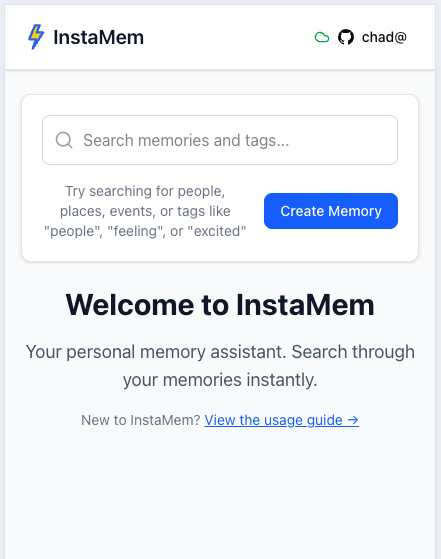
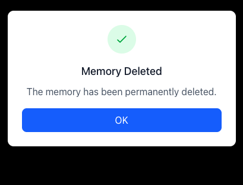

# InstaMem Usage Guide

InstaMem is your personal memory assistant that helps you instantly search and recall the details of your life. This guide will walk you through all the key features and how to use them effectively.

## Getting Started

InstaMem works like a personal search engine for your memories with **INSTANT results**. Data is stored locally so search results appear immediately as you type — no waiting, no loading delays. Simply add memories as they happen, and use natural language search to find them later.

When you first open InstaMem, you'll see the welcome screen with a search bar and "Create Memory" button. New users get helpful tips and a link to this usage guide.

## Main Interface

The main interface shows:

-   **Search bar**: Enter keywords, people, places, or feelings to find memories
-   **Search results**: Displays matching memories with dates and tags
-   **Tag chips**: Blue tags show categories like people, places, and feelings
-   **External links**: Click the arrow icon to open associated URLs

### Search Features

**INSTANT Search — Zero Latency Results:**
- Results appear **immediately** as you type — literally instant, no delays
- All data cached locally for maximum speed
- Works perfectly offline with full search capabilities

**Smart Search Types:**

-   **1-2 characters**: Exact matching (e.g., "s" finds entries containing "s")
-   **3+ characters**: Fuzzy matching (e.g., "feeback" will find "feedback")
-   **People**: Search by names like "Chad" or "John"
-   **Places**: Find memories by location like "Trader Joes"
-   **Feelings**: Search emotions like "excited", "proud", "gratified"
-   **Mixed search**: Combine multiple terms for precise results

**Advanced Tag Features (Coming Soon):**
- **Tag-enhanced results** — see relevant tags in search results to quickly refine
- **Click tags to search** — instant tag-based filtering
- **Tag cloud management** — visual organization of your tag system

## Creating Memories

To add a new memory:

1. **Click "Create Memory"** button on the main page
2. **Memory Content**: Describe what happened in natural language
3. **Date**: Set when the memory occurred (defaults to today)
4. **URL (optional)**: Add links to related content, photos, or documents
5. **Tags**: The app suggests relevant tags from your existing tag library (plus feeling suggestions), or create your own

**Customizable Tagging System**: Create your own tag categories to organize memories your way:

-   `person:john` for people in your life
-   `place:Trader Joes` for locations and experiences
-   `feeling:excited` for emotions and moods
-   `project:InstaMem` for work and personal projects
-   `genre:jazz` for music, books, or entertainment
-   `skill:programming` for learning and development

Type and press space/comma to create new tags. The system learns your patterns and suggests relevant tags.

**Smart Feeling Tags**: When adding emotion tags, InstaMem provides helpful definitions to help you choose the most accurate feeling. For example, you'll see distinctions between "excited" (enthusiastic anticipation) vs "elated" (extremely happy) vs "euphoric" (intense excitement).

## Editing Memories

When editing a memory:

1. **Modify content**: Update the memory description
2. **Change date**: Adjust when the memory occurred
3. **Update URL**: Add or modify associated links
4. **Smart tag suggestions**: As you type, InstaMem suggests relevant tags based on your existing tag library
5. **Feeling definitions**: The dropdown shows different emotions with helpful descriptions to choose the most accurate feeling

**Example feeling suggestions with definitions:**

-   `feeling: accomplished` - "Pleased and satisfied"
-   `feeling: proud` - "Feeling satisfaction in achievements"
-   `feeling: affectionate` - "Showing fondness and care"
-   `feeling: disaffected` - "Dissatisfied and rebellious"

The tag suggestion system learns from your previous entries and helps maintain consistency while the definitions ensure you pick the most precise emotional tags.

## User Account Management

Access account features via the user dropdown:

-   **Online status**: Shows connection and last sync time
-   **Sync**: Manually trigger synchronization of memories
-   **Sign out**: Log out of your account

**Sync Status**: The app shows when you're online/offline and when data was last synchronized across devices.

## Deleting Memories

|                                                                         |                                                                     |
| ----------------------------------------------------------------------- | ------------------------------------------------------------------- |
|  |  |

To remove a memory:

1. **Click the edit icon** on any memory
2. **Select delete option**
3. **Confirm deletion**: Review the memory content in the confirmation dialog
4. **Permanent action**: Deletions cannot be undone

After deletion, you'll see a confirmation that the memory has been permanently removed.

## Tips for Effective Use

### Memory Creation Best Practices

1. **Be descriptive**: Include context, people, and feelings
2. **Add URLs**: Link to photos, documents, or related content
3. **Use consistent naming**: Keep person/place names consistent for better search
4. **Include emotions**: Tag how you felt - it makes memories more searchable

### Search Tips

1. **Start broad, then narrow**: Begin with general terms, then add specifics
2. **Use tag categories**: Search "person:john" to find all memories with John
3. **Try variations**: If exact spelling doesn't work, the fuzzy search will help
4. **Combine terms**: Mix people, places, and feelings for precise results

### Organization Strategies

1. **Regular entry**: Add memories daily while details are fresh
2. **Consistent tagging**: Use similar tag patterns for related memories
3. **Date accuracy**: Correct dates help with chronological search
4. **URL linking**: Connect memories to photos, emails, or documents

## Offline Features

InstaMem works offline for:

-   **Searching existing memories**: Full search functionality without internet
-   **Reading memories**: Browse your complete memory library from search results
-   **Viewing memory details**: Click edit buttons to view full memory content, tags, and details in read-only mode

**Note**: Creating and editing memories requires an internet connection for tag suggestions and cloud synchronization. When offline, the edit form becomes read-only for viewing.

## Privacy & Security

-   **Personal data**: All memories are private to your account
-   **Cloud sync**: Data synchronizes securely across your devices
-   **Local storage**: Recent memories are cached locally for offline access
-   **Authentication**: Secure login protects your personal memories

## Troubleshooting

**Search not finding memories?**

-   Try broader search terms
-   Check spelling (fuzzy search helps with typos)
-   Ensure memories are synced if on mobile

**Sync issues?**

-   Check internet connection
-   Try manual sync from user dropdown
-   Refresh the page if needed

**Missing memories?**

-   Verify you're logged into the correct account
-   Check if memories were created on another device and need sync

---

InstaMem helps you remember the details that matter. The more you use it, the more powerful your personal memory search becomes!
